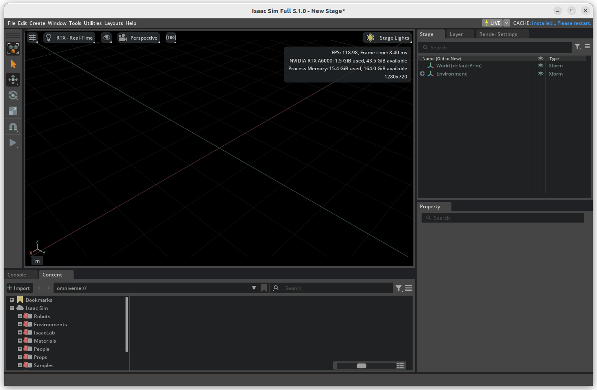
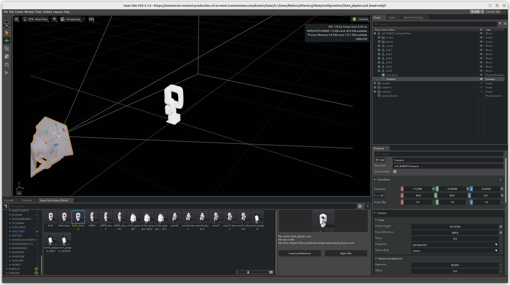

# CDC-2026

## Paper Track

#### Todo List

  - [ ] add paper reference
  - [ ] add structure frame

## Code Track

#### Todo List

  - [ ] build `.env` link to Iassac Sim/Lab
  - [ ] add link to `.urdf` to Dreamer V3
  - [ ] reinstall Issac Sim 5.0
  - [ ] Install Issac Sim v5.1
  - [ ] install ROS2 2 Humble
  - [ ] Deactive conda to use ROS2
  - [ ] build a simulation environment(visual,object,xarm,control sequence)

`source /opt/ros/humble/setup.zsh`
`source ~/ws_moveit2/install/setup.zsh`

---
#### Reference

https://docs.isaacsim.omniverse.nvidia.com/5.0.0/installation/quick-install.html
https://docs.isaacsim.omniverse.nvidia.com/5.1.0/installation/quick-install.html
https://docs.ros.org/en/rolling/Installation/Ubuntu-Install-Debs.html